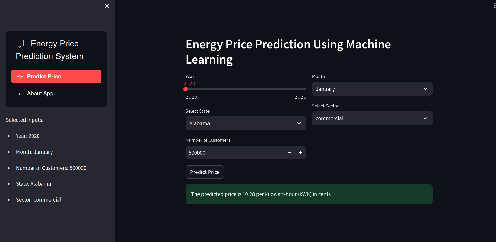
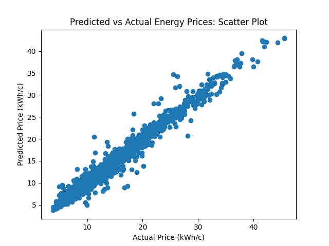

# Energy Price Prediction Project

This project is developed by Ogunsanya James for the Optimus AI Labs Hackathon. The goal of this project is to build a machine learning model and a user interface application for predicting energy prices. The dataset used for training the model was obtained from Kaggle and can be found [here](https://www.kaggle.com/datasets/alistairking/electricity-prices?select=clean_data.csv).

---

---

## Overview

Energy price prediction is a crucial task for energy companies, policymakers, and consumers alike. Accurate predictions can help optimize energy production and consumption, leading to cost savings and improved resource management. In this project, the aim is to develop a machine learning model that can predict energy prices based on historical data and relevant features.

---

## Technologies Used

- Python for model developement 

- Random Forest Regressor

- Streamlit for the UI

## Model Accuracy


## Project Structure

The project is organized into two main components:

1. **Machine Learning Model (`ml_model/`):**
   - `data/`: Directory containing the dataset files used for training and testing.
   - `notebook.ipynb`: Jupyter notebook for data exploration, model development, and evaluation.
   - `*.pkl and .sav`: Saved encoder trained model files.

2. **Streamlit User Interface Application (`ui_app/`):**
   - `app.py`: Contains script for the stremlit app.
   
## Setup Instruction


To set up the project environment and run the application locally, follow these steps:

1. Clone the repository to your local machine:

   ```bash
   git clone https://github.com/Oyindamolajames/energy-price-prediction.git
   ```

2. Navigate to the project directory:

   ```bash
   cd energy-price-prediction
   ```

3. Set up the virtual environment:

   ```bash
   python -m venv .venv
   ```

4. Activate the virtual environment:

   ```bash
   source .venv/bin/activate
   ```

5. Install the libraries:

   - pip install -r requirements.txt
   
6. Run the Streamlit app to start the UI:

   ```bash
   cd ui_app
   streamlit run app.py
   ```

7. Access the UI application in your web browser at `http://localhost:8501`.

## Demo

Here is the link to the live project [here](https://energypriceprediction-wymvjkehsolfuyhrn6mshy.streamlit.app/)


## Acknowledgments

- [Alistair King](https://www.kaggle.com/alistairking) for providing the dataset on Kaggle.
- Optimus AI Labs for organizing the hackathon.
## Author
- **Ogunsanya James** - Machine Learning Engineer
- [Github](https://www.github.com/oyindamolajames)
- [Linkdin](https://www.linkedin.com/in/james-ogunsanya-7088928a/)


## Feedback

If you have any feedback, please reach out to us at oyindamolajames@gmail.com

